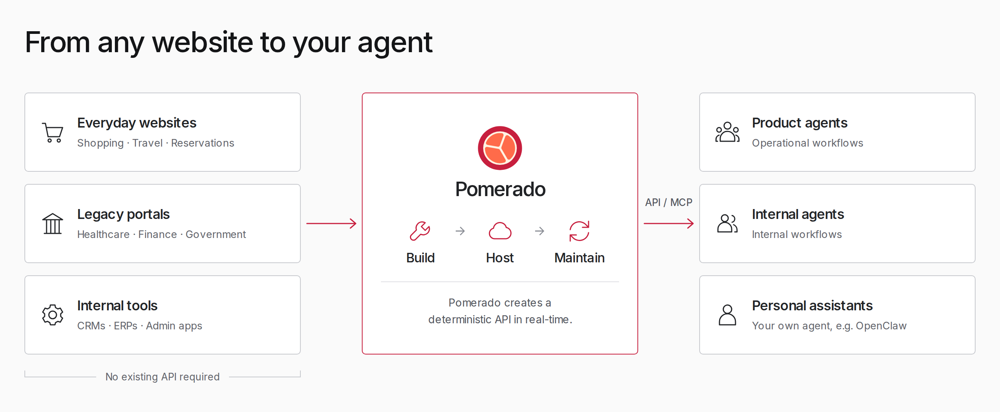
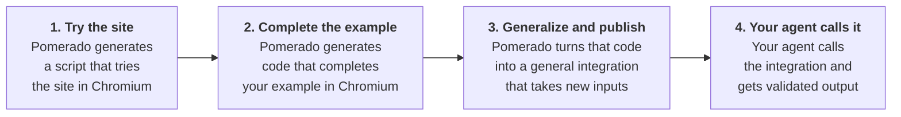

<h1 align="center"><a href="https://pomerado.ai">Pomerado</a></h1>

<p align="center">Turn websites into MCP integrations your agent can rely on.</p>

<p align="center">
  <a href="LICENSE"></a>
  <a href="https://www.npmjs.com/package/pomerado"></a>
  
</p>

<p align="center">
  <a href="#how-it-works">How it works</a> ·
  <a href="#get-started">Get started</a> ·
  <a href="#create-an-integration">Create an integration</a> ·
  <a href="#use-your-integration">Use your integration</a> ·
  <a href="#open-source-and-pomerado-cloud">Open source and Cloud</a> ·
  <a href="#documentation-for-humans-and-agents">Docs</a> ·
  <a href="#contributing">Contributing</a>
</p>

---

## What Pomerado does

Pomerado builds MCP integrations for websites, including sites without an API.
- Our tool builds integrations with only a natural language description of the task. No HAR file or recording is needed
- Integrations are deterministic, making them much faster and more reliable than computer use
- Pomerado works on any site, including sites behind a login and two-factor authentication

<p align="center"></p>

## How it works



Guardian is a second model that reviews each browser action and the finished source. [How it works](docs/how-it-works.md) covers the minter, Guardian, the runtime and jobs.

## Get started

You need these first.

- macOS or Linux.
- Node 24.21 or a later Node 24 release. Check with `node --version`.
- An OpenAI API key. Pomerado calls OpenAI models to build and review integrations. Your agent can run on any model.
- An MCP client that runs local servers, such as Claude Code, Codex, Cursor, VS Code, Claude Desktop or Gemini CLI.

Install Pomerado and its browser.

```sh
npx -y -p pomerado pomerado-mcp --help
npx -y -p pomerado playwright install chromium
```

- The first command downloads Pomerado and prints its usage. Running it once lets your client start Pomerado from npm's cache.
- The second command installs the Chromium build that Pomerado's Playwright expects. Playwright may warn about project dependencies. The browser installs anyway.
- On Linux, add `--with-deps` after `install` if Chromium's system libraries are missing.

Pomerado is a standard MCP stdio server. This is its entry for clients that read an `mcpServers` file.

```json
{
  "mcpServers": {
    "pomerado": {
      "command": "npx",
      "args": ["-y", "-p", "pomerado", "pomerado-mcp", "mint", "--root", "/absolute/path/to/pomerado-integrations"]
    }
  }
}
```

- `--root` is the folder where Pomerado saves integrations. Use an absolute path, because clients start servers from different folders.
- The server needs `OPENAI_API_KEY` in its environment. Keep the key out of chat.
- Starting the server and listing its tools launches no browser and calls no model.

Add Pomerado to your client.

| Client | Add Pomerado |
| --- | --- |
| Claude Code | `claude mcp add --scope user pomerado -- npx -y -p pomerado pomerado-mcp mint --root ~/pomerado-integrations` |
| Codex | `codex mcp add pomerado -- npx -y -p pomerado pomerado-mcp mint --root ~/pomerado-integrations`, then add `env_vars` |
| Gemini CLI | `gemini mcp add -s user -e 'OPENAI_API_KEY=$OPENAI_API_KEY' pomerado npx -y -p pomerado pomerado-mcp mint --root ~/pomerado-integrations` |
| Cursor | Add the entry to `~/.cursor/mcp.json` |
| VS Code | `code --add-mcp '{"name":"pomerado","command":"npx","args":["-y","-p","pomerado","pomerado-mcp","mint","--root","/absolute/path/to/pomerado-integrations"]}'`, or add the entry to `.mcp.json` in your workspace |
| Claude Desktop | Add the entry to `claude_desktop_config.json` |

Each client passes the key differently. [Client settings](docs/getting-started.md#client-settings) covers the key and the timeouts for every client in the table.

Ask your agent which Pomerado tools it has. It should list `mint`, `get_job`, `provide_input` and `cancel_job`.

## Let your agent set it up

Paste this into your agent.

```text
Set up Pomerado for me by following https://raw.githubusercontent.com/Pomerado/pomerado/main/docs/agent-setup.md
```

The agent checks Node, installs Chromium and adds Pomerado to the client it runs in. It asks before changing anything you didn't mention. It never asks for your key in chat.

## Create an integration

Ask your agent to create an integration with Pomerado. We call this minting.

> Use Pomerado to create an integration named example_reader that reads the main heading from https://example.com. Keep it read-only.

Your agent uses four tools.

- `mint` starts a job from a name, a URL, a task, optional input and `read` or `write` authority. It returns a job ID right away.
- `get_job` waits up to 30 seconds for progress, a question or the result. Checking never starts the work again.
- `provide_input` sends your answer to a question. Pomerado checks the answer against the question's format.
- `cancel_job` stops the job and closes its browser. An action already sent to a website may have taken effect.

Tell your agent which authority to use. It picks one when it calls `mint`, and the tool's description tells it to ask you before it picks `write`.

- Choose `read` when the task only looks at the website.
- Choose `write` only when the task changes something, such as submitting a form.
- A write mint performs that action once while it builds, then checks the final source without repeating it.
- A read mint that finds the task needs a change can ask to switch to write. That question reaches your agent like any other, and the answer it sends switches the job.

Names start with a lowercase letter and use lowercase letters, digits and underscores. The integration's folder must not exist yet. A mint gets 20 minutes of active work, and time spent waiting for your answers doesn't count.

## Use your integration

When minting finishes, Pomerado saves the integration and returns its paths.

```text
pomerado-integrations/example_reader/
├── src/                 Generated operation modules
├── pomerado.json        Entrypoint and input and output schemas
├── deployment.json      Tool name, description, URL, task and authority
├── mcp.mjs              Launcher for the shared Pomerado runtime
├── mcp.json             Standard MCP server entry, with no key
└── README.md            Add commands for each MCP client
```

1. Open the integration's `README.md`. It has the add command for each major client, with your paths filled in.
2. Add the server and give it `OPENAI_API_KEY` the same way as Pomerado. Guardian reviews every run.
3. Reload your client and ask your agent to use the integration.

> Use example_reader to read the page heading.

- The integration has one tool named after it, with its arguments under `input`.
- It also has `get_job`, `provide_input` and `cancel_job` for calls that need an answer or more time.
- A call returns output that matches the schema in `pomerado.json`, or a job ID to continue.
- Calling the tool again starts a new run. With write authority that means another write.
- The integration runs on the Pomerado installation that minted it. For a fixed path, install with `npm install -g pomerado` and use `pomerado-mcp` in place of `npx -y -p pomerado pomerado-mcp`.

## Open source and Pomerado Cloud

This repository is the complete Pomerado core. You can mint and run integrations with it without a Pomerado account.

- The minter builds integrations in a real Chromium browser.
- The minting harness and prompts are the same ones Pomerado Cloud builds on.
- Guardian reviews each browser action and the finished source.
- The standalone host runs each integration as an MCP server on your own computer.
- Each integration is source code in your own folder, and you own it.

[Pomerado Cloud](https://pomerado.ai) runs this same core and adds hosting and operations.

- It hosts your integrations and runs their jobs.
- It brokers OAuth and keeps saved logins.
- It controls who can use each integration.
- It runs a managed browser fleet that handles bot protection.
- It detects when a site change breaks an integration and repairs it automatically.

## Documentation for humans and agents

- [Getting started](docs/getting-started.md) covers install, client settings, a first integration and troubleshooting.
- [Agent setup](docs/agent-setup.md) gives an AI agent the steps to install Pomerado for you.
- [How it works](docs/how-it-works.md) covers the minter, Guardian, the runtime, jobs and the library.
- [AGENTS.md](AGENTS.md) tells coding agents how to change this repository.
- [CONTRIBUTING.md](CONTRIBUTING.md) covers building from source and how changes land.
- [RELEASING.md](docs/RELEASING.md) covers how npm releases are built and verified.

## Repository guide

| Path | Contents |
| --- | --- |
| `typescript/src/` | Minter, Guardian, runtime, browser helpers and the local MCP host |
| `typescript/authoring/` | Shared prompts and examples for local and hosted minting |
| `typescript/tests/` | Unit tests and browser tests with local fixture sites |
| `tools/` | Build helpers and the CI scans |
| `docs/` | Guides for users, agents and maintainers |
| `third-party/` | Licenses for adapted third-party code |

[How it works](docs/how-it-works.md#source-layout) lists each module under `typescript/src/`.

## Contributing

- Issues are welcome.
- Outside pull requests open once the review and approval gate in [CONTRIBUTING.md](CONTRIBUTING.md) is live.
- Security problems go privately through **Report a vulnerability** on the [Security tab](https://github.com/Pomerado/pomerado/security).
- [CONTRIBUTING.md](CONTRIBUTING.md) has the clone, build and test steps.

## License

Copyright (c) 2026 Pomerado AI, Inc. Licensed under the MIT License (`MIT`). See [LICENSE](LICENSE).

Versions 0.1.2 and earlier were published under the GNU Affero General Public License version 3 only (`AGPL-3.0-only`).

Third-party code keeps its own license. The Guardian policy in `typescript/src/guardian/upstream-policy.md` is adapted from [OpenAI Codex](https://github.com/openai/codex) under the Apache License 2.0. Its license and notice are in [third-party/codex/](third-party/codex/) and ship with the npm package.
