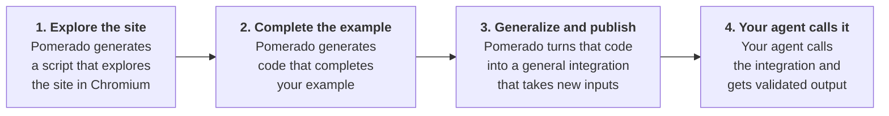

<h1 align="center"><a href="https://pomerado.ai">Pomerado</a></h1>

<p align="center">Turn websites into MCP integrations your agent can rely on.</p>

<p align="center">
  <a href="LICENSE"></a>
  <a href="https://www.npmjs.com/package/pomerado"></a>
  
</p>

<p align="center">
  <a href="#how-it-works">How it works</a> ·
  <a href="#get-started">Get started</a> ·
  <a href="#create-an-integration">Create an integration</a> ·
  <a href="#use-your-integration">Use your integration</a> ·
  <a href="#open-source-and-pomerado-cloud">Open source and Cloud</a> ·
  <a href="#documentation-for-humans-and-agents">Docs</a> ·
  <a href="#contributing">Contributing</a>
</p>

---

## What Pomerado does

Pomerado builds MCP integrations for websites, including sites without an API.

- Our tool builds integrations with only a natural language description of the task. No HAR file or recording is needed
- Integrations are deterministic, making them much faster and more reliable than computer use
- Pomerado works on sites behind a login and two-factor authentication

## How it works



For more details, see [How it works](docs/how-it-works.md).

## Get started

Prerequisites

- macOS or Linux
- Node 24.21 or a later Node 24 release, which you can check with `node --version`
- An OpenAI API key, since Pomerado uses OpenAI models to build and review integrations. Your agent can run on any model
- An MCP client that runs local servers, such as Claude Code, Codex, Cursor, VS Code, Claude Desktop or Gemini CLI

Install Pomerado and the Chromium build it drives.

```sh
npx -y -p pomerado pomerado-mcp --help
npx -y -p pomerado playwright install chromium
```

On Linux, add `--with-deps` after `install` if Chromium's system libraries are missing.

Pomerado runs as a standard MCP stdio server. Clients that read an `mcpServers` file use this entry.

```json
{
  "mcpServers": {
    "pomerado": {
      "command": "npx",
      "args": ["-y", "-p", "pomerado", "pomerado-mcp", "mint", "--root", "/absolute/path/to/pomerado-integrations"]
    }
  }
}
```

- `--root` sets the folder where Pomerado saves your integrations. Use an absolute path, because each client starts servers from its own working folder
- The server reads `OPENAI_API_KEY` from its environment, so the key never needs to appear in chat
- Starting the server and listing its tools costs nothing. It launches no browser and calls no model until you start a mint

Add Pomerado to your client with the command or file below.

| Client | Add Pomerado |
| --- | --- |
| Claude Code | `claude mcp add --scope user pomerado -- npx -y -p pomerado pomerado-mcp mint --root ~/pomerado-integrations` |
| Codex | `codex mcp add pomerado -- npx -y -p pomerado pomerado-mcp mint --root ~/pomerado-integrations`, then add `env_vars` |
| Gemini CLI | `gemini mcp add -s user -e 'OPENAI_API_KEY=$OPENAI_API_KEY' pomerado npx -y -p pomerado pomerado-mcp mint --root ~/pomerado-integrations` |
| Cursor | Add the entry to `~/.cursor/mcp.json` |
| VS Code | `code --add-mcp '{"name":"pomerado","command":"npx","args":["-y","-p","pomerado","pomerado-mcp","mint","--root","/absolute/path/to/pomerado-integrations"]}'`, or add the entry to `.mcp.json` in your workspace |
| Claude Desktop | Add the entry to `claude_desktop_config.json` |

Each client passes environment variables its own way. [Client settings](docs/getting-started.md#client-settings) covers the key and the timeouts for every client above.

To confirm the setup, ask your agent which Pomerado tools it has. It should list `mint`, `get_job`, `provide_input` and `cancel_job`.

## Let your agent set it up

If you'd rather not run these steps yourself, paste this into your agent.

```text
Set up Pomerado for me by following https://raw.githubusercontent.com/Pomerado/pomerado/main/docs/agent-setup.md
```

Your agent checks your Node version, installs Chromium and adds Pomerado to the client it runs in. It asks before changing anything you didn't mention, and it never asks for your API key in chat.

## Create an integration

Ask your agent to create an integration with Pomerado. We call this minting. A good request names the site, describes the task in plain language and says whether the integration should only read or also make changes.

> Use Pomerado to create an integration named example_reader that reads the main heading from https://example.com. Keep it read-only.

Your agent runs the mint with four tools.

- `mint` starts a job from a name, a URL, a task, an optional example input and `read` or `write` authority. It returns a job ID right away
- `get_job` waits up to 30 seconds for progress, a question or the result. Checking a job never restarts the work
- `provide_input` sends your answer when Pomerado asks a question. Pomerado checks the answer against the question's format
- `cancel_job` stops the job and closes its browser. An action already sent to a website may still have taken effect

Authority decides what an integration is allowed to do, so choose it deliberately. Your agent picks one when it calls `mint`, and the tool tells it to ask you before choosing `write`.

- Use `read` when the task only looks at a website
- Use `write` only when the task changes something, such as submitting a form or making a booking
- A write mint performs the action once while it builds, then reviews the final source without repeating it
- A read mint that finds the task needs a change asks to switch to write, and your agent's answer decides
- A run doesn't check authority or intent, and edits to `src/` or `deployment.json` aren't reviewed. A run that signs in replays its sign-in only on the site and the sign-in origins in `deployment.json`

Names start with a lowercase letter and use only lowercase letters, digits and underscores. The integration's folder must not exist yet. Each mint gets 20 minutes of active work, and time spent waiting for your answers doesn't count against it.

## Use your integration

When minting finishes, Pomerado saves the integration as a folder of source code and returns its paths.

```text
pomerado-integrations/example_reader/
├── src/                 Generated operation modules
├── pomerado.json        Entrypoint and input and output schemas
├── auth-fill.json       Sign-in screens a build that signed in recorded, with no value
├── deployment.json      Tool name, description, URL, task and authority
├── mcp.mjs              Launcher for the shared Pomerado runtime
├── mcp.json             Standard MCP server entry, with no key
└── README.md            Add commands for each MCP client
```

1. Open the integration's `README.md`. It has the add command for each major client with your paths already filled in
2. Add the server with that command. Skip the key setup. Running an integration makes no model request, so only minting needs `OPENAI_API_KEY`
3. Reload your client and ask your agent to use the integration

> Use example_reader to read the page heading.

Each integration appears to your agent as its own MCP server.

- It has one tool named after the integration, with its arguments under `input`
- It also has `get_job`, `provide_input` and `cancel_job` for calls that need an answer or more time
- A call returns output that matches the schema in `pomerado.json`, or a job ID to follow up on
- A failed call returns a job with a `code`, `write_status`, `possible_commit` and `retry`. Read the site back before calling again when `possible_commit` is true
- Each call without an `idempotency_key` is a new run. With write authority, calling again performs the write again
- A write tool takes an optional `idempotency_key`. A call that repeats the key and input answers the first job and writes nothing, even after a server restart
- An integration whose build signed in signs in on each call. It asks for the login, and any code or answer the site needs, and saves none of them
- The integration runs on the Pomerado installation that minted it. For a stable path, install globally with `npm install -g pomerado` and use `pomerado-mcp` in place of `npx -y -p pomerado pomerado-mcp`

## Open source and Pomerado Cloud

This repository is the complete Pomerado core, released under the MIT license. Everything you need to mint integrations and run them yourself is here, with no Pomerado account required.

- The minter, which builds integrations in a real Chromium browser
- The minting harness and prompts that Pomerado Cloud also builds on
- Guardian, which reviews each browser action and the finished source while minting, not when an integration runs
- The standalone host, which serves each integration as an MCP server on your own machine
- The integrations themselves, saved as source code in your folder that you own

[Pomerado Cloud](https://pomerado.ai) runs this same core as a managed service. It adds the operations that production use needs.

- Hosting for your integrations and their jobs
- OAuth brokerage and saved logins
- Access control over who can use each integration
- A managed browser fleet that handles bot protection
- Breakage detection that notices when a site changes and repairs the integration automatically

## Documentation for humans and agents

- [Getting started](docs/getting-started.md) covers install, client settings, a first integration and troubleshooting.
- [Agent setup](docs/agent-setup.md) gives an AI agent the steps to install Pomerado for you.
- [How it works](docs/how-it-works.md) covers the minter, Guardian, the runtime, jobs and the library.
- [AGENTS.md](AGENTS.md) tells coding agents how to change this repository.
- [CONTRIBUTING.md](CONTRIBUTING.md) covers building from source and how changes land.
- [RELEASING.md](docs/RELEASING.md) covers how npm releases are built and verified.

## Repository guide

| Path | Contents |
| --- | --- |
| `typescript/src/` | Minter, Guardian, runtime, browser helpers and the local MCP host |
| `typescript/authoring/` | Shared prompts and examples, with sections a host can replace |
| `typescript/tests/` | Unit tests and browser tests with local fixture sites |
| `tools/` | Build helpers and the CI scans |
| `docs/` | Guides for users, agents and maintainers |
| `third-party/` | Licenses for adapted third-party code |

[How it works](docs/how-it-works.md#source-layout) lists each module under `typescript/src/`.

## Contributing

- Issues are welcome.
- Outside pull requests open once the review and approval gate in [CONTRIBUTING.md](CONTRIBUTING.md) is live.
- Security problems go privately through **Report a vulnerability** on the [Security tab](https://github.com/Pomerado/pomerado/security).
- [CONTRIBUTING.md](CONTRIBUTING.md) has the clone, build and test steps.

## License

Copyright (c) 2026 Pomerado AI, Inc. Licensed under the MIT License (`MIT`). See [LICENSE](LICENSE).

Versions 0.1.2 and earlier were published under the GNU Affero General Public License version 3 only (`AGPL-3.0-only`).

Third-party code keeps its own license. The Guardian policy in `typescript/src/guardian/upstream-policy.md` is adapted from [OpenAI Codex](https://github.com/openai/codex) under the Apache License 2.0. Its license and notice are in [third-party/codex/](third-party/codex/) and ship with the npm package.
